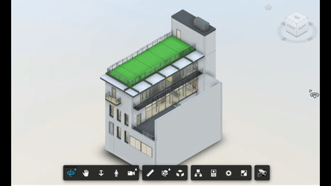

# Camera Rotation

This extension can be used for model demo purpose, it just rotates the building or the model for look around.



## Usage

Click on the toolbar button to start rotating, click again to stop.

## Setup

Include the CSS & JS file on your page. This CDN is compatible with the lastest Viewer version (v7).

```xml
<link rel="stylesheet" href="http://cdn.jsdelivr.net/gh/autodesk-forge/forge-extensions/public/extensions/camerarotation/contents/main.css">
<script src="http://cdn.jsdelivr.net/gh/autodesk-forge/forge-extensions/public/extensions/camerarotation/contents/main.js"></script>
```

After Viewer is ready, preferable inside `onDocumentLoadSuccess`, load the extension

```javascript
viewer.loadExtension("CameraRotation")
```

## How it works
