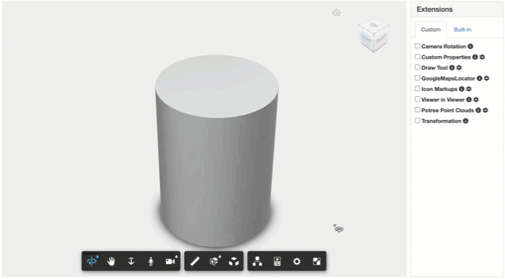

# Custom Properties Extension

[Demo](https://forge-extensions.autodesk.io/?extension=CustomPropertiesExtension)

Extension showing custom properties in the Properties palette, based on their `dbId`.



## Setup

Include the JS file on your page. This CDN is compatible with the lastest Viewer version (v7).

```xml
<script src="http://cdn.jsdelivr.net/gh/autodesk-forge/forge-extensions/public/extensions/CustomPropertiesExtension/contents/main.js"></script>
```

Load the extension passing the properties you want to add to various objects based on their `dbId`. 

```javascript
viewer.loadExtension('CustomPropertiesExtension', {
    "properties": {
        "1": {
            "My Group": {
                "My Property": "My Property Value"
            }
        },
        "3": {
            "My Other Group": {
                "My Other Property": "My Other Property Value"
            }
        }
    }
})
```

## Configuration

The `properties` contains the dbId's you assign custom properties to. 

## How it works

The custom properties will appear in the Properties palette.

## Futher reading

The sample is based on [this blog post](https://forge.autodesk.com/blog/adding-custom-properties-property-panel).
