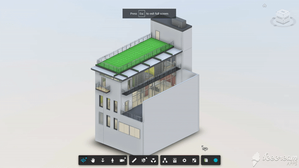

# Draw Tool Extension

[Demo](https://forge-extensions.autodesk.io/?extension=DrawToolExtension)

A simple tool that will allow us to draw boxes and spheres. Please use the Draw Tool in only full screen mode.



## Usage

Load the extension and enter fullscreen. And here's how the drawing works:  

. on mouse button down event the tool will start "drawing" the geometry in the XY plane  
. on mouse button up event, the tool will start monitoring mouse move events to control the height of the geometry  
. on mouse click event, the geometry will be finalized  

## Setup

Include the CSS & JS file on your page. This CDN is compatible with the lastest Viewer version (v7).

```xml
<link rel="stylesheet" href="http://cdn.jsdelivr.net/gh/autodesk-forge/forge-extensions/public/extensions/DrawToolExtension/contents/main.css">
<script src="http://cdn.jsdelivr.net/gh/autodesk-forge/forge-extensions/public/extensions/DrawToolExtension/contents/main.js"></script>
```

## Futher reading

Detailed technical explaination can be found in [this blog post](https://forge.autodesk.com/blog/custom-tools-forge-viewer). 

## Author  
[Petr Broz](https://twitter.com/ipetrbroz)

