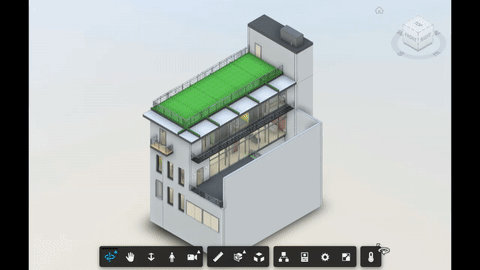

# Icon Markup Extension

Extension showing labels on top of elements, based on their `dbId`.



## Setup

Include the CSS & JS file on your page. This CDN is compatible with the lastest Viewer version (v7).

```xml
<link rel="stylesheet" href="http://cdn.jsdelivr.net/gh/autodesk-forge/forge-extensions/public/extensions/IconMarkupExtension/contents/main.css">
<script src="http://cdn.jsdelivr.net/gh/autodesk-forge/forge-extensions/public/extensions/IconMarkupExtension/contents/main.js"></script>
```

The following sample uses [font-awesome](https://fontawesome.com) icons, but any CSS icon library can be used.

```xml
<link rel="stylesheet" href="https://cdnjs.cloudflare.com/ajax/libs/font-awesome/5.11.2/css/all.min.css" />
```
Load the extension passing the `dbId`, `label` and `css` for the label. Toolbar button and onClick event can also be configured. 

```javascript
viewer.loadExtension('IconMarkupExtension', {
            button: {
                icon: 'fa-thermometer-half',
                tooltip: 'Show Temperature'
            },
            icons: [
                { dbId: 3944,   label: '300&#176;C', css: 'fas fa-thermometer-full' },
                { dbId: 721,    label: '356&#176;C', css: 'fas fa-thermometer-full' },
                { dbId: 10312,  label: '450&#176;C', css: 'fas fa-thermometer-empty' },
                { dbId: 563,                         css: 'fas fa-exclamation-triangle' },
            ],
            onClick: (id) => {
                viewers.select(id);
                viewers.utilities.fitToView();
                switch (id){
                    case 563:
                        alert('Sensor offline');
                }
            }
        })
```

## Configuration

The `button` attribute defines the toolbar button. The `icons` contains the labels shwon on the model. Last, `onClick` is triggered when the user clicks on the label. 

## How it works

Labels are positioned over the Viewer canvas and repositioned when the camera changes (e.g. pan, zoom or rotate).

## Futher reading

Detailed technical explaination can be found at [this blog post](https://forge.autodesk.com/blog/placing-custom-markup-dbid). This [live sample](http://forgeplant.herokuapp.com) shows an sample application.
