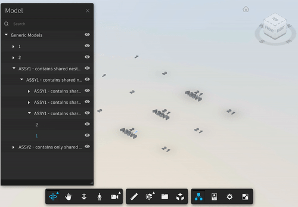

# TAB Selection Extension

[Demo](https://forge-extensions.autodesk.io/?extension=TabSelectionExtension)

Use TAB key to rotate selection, similar to Revit TAB to select nested families.



## Setup

Include the JS file on your page. This CDN is compatible with the lastest Viewer version (v7).

```xml
<script src="http://cdn.jsdelivr.net/gh/autodesk-forge/forge-extensions/public/extensions/TabSelectionExtension/contents/main.js"></script>
```

Load the extension passing the properties you want to add to various objects based on their `dbId`. 

```javascript
viewer.loadExtension('TabSelectionExtension');
```

## How it works

Select an element, press TAB to select the parent node. Each TAB press will move up on the tree until the root, then reset back to the initial selection.
