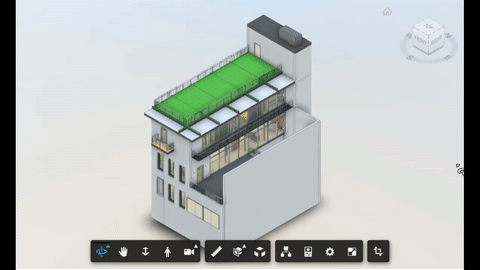

# Transform

Allows moving elements on the model.



## Usage

Enable the extension, click on the model element, use the `gizmo` to move the element.

## Setup

Include the CSS & JS file on your page. This CDN is compatible with the lastest Viewer version (v7).

```xml
<link rel="stylesheet" href="http://cdn.jsdelivr.net/gh/autodesk-forge/forge-extensions/public/extensions/transform/contents/main.css">
<script src="http://cdn.jsdelivr.net/gh/autodesk-forge/forge-extensions/public/extensions/transform/contents/main.js"></script>
```

After Viewer is ready, preferable inside `onDocumentLoadSuccess`, load the extension

```javascript
viewer.loadExtension("TransformationExtension")
```

## How it works

Based on the Three.js [transform control](https://threejs.org/examples/misc_controls_transform.html), the development team implemented the section command using this nice 3d manipulator allowing to select plane, axis and rotation. This is provided out of the box with the [GuiViewer3D](https://forge.autodesk.com/en/docs/viewer/v7/reference/Viewing/GuiViewer3D/)

Reusing some of their implementation to provide the ability to stick the control on the selected mesh and drag it around. It's more challenging that it may seem as the viewer has a complex way to work with Three.js meshes. This is due to enhancements that we created on top of that library to be able to support models with a huge number of meshes.
