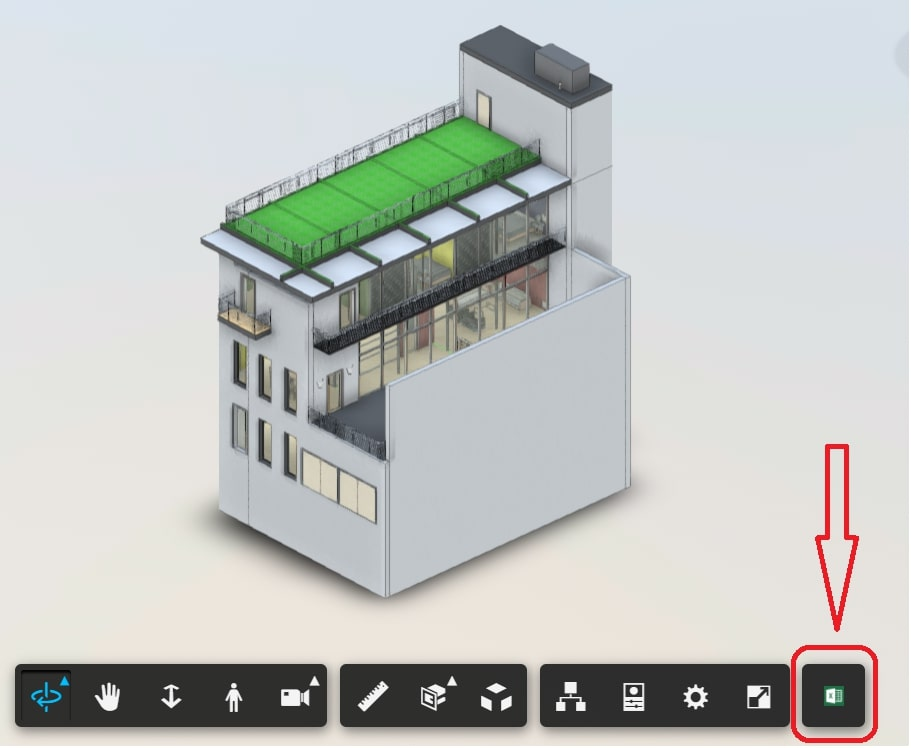

# XLS Extension

This extension demonstrates how to extract metadata and export it as excel file

[Demo](https://forge-extensions.autodesk.io/?extension=XLSExtension)



## Usage

Load the extension and click on excel icon on toolbar. 

## Setup

Include the CSS & JS file on your page. This CDN is compatible with the lastest Viewer version (v7).

```xml
<link rel="stylesheet" href="http://cdn.jsdelivr.net/gh/autodesk-forge/forge-extensions/public/extensions/DrawToolExtension/contents/main.css">
<script src="http://cdn.jsdelivr.net/gh/autodesk-forge/forge-extensions/public/extensions/DrawToolExtension/contents/main.js"></script>
```

## External Dependencies

This sample uses [SheetJS](https://github.com/SheetJS/js-xlsx) and [FileSaver](https://github.com/eligrey/FileSaver.js) as main dependencies. [Notifier](https://notifyjs.jpillora.com/) is a secondary or non-core dependency.


